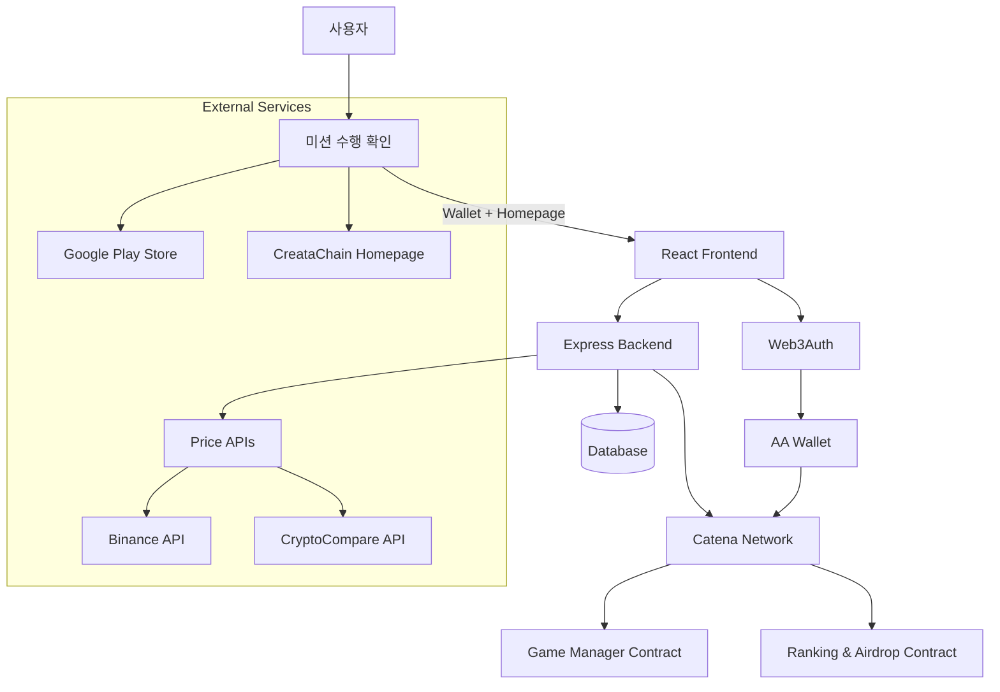
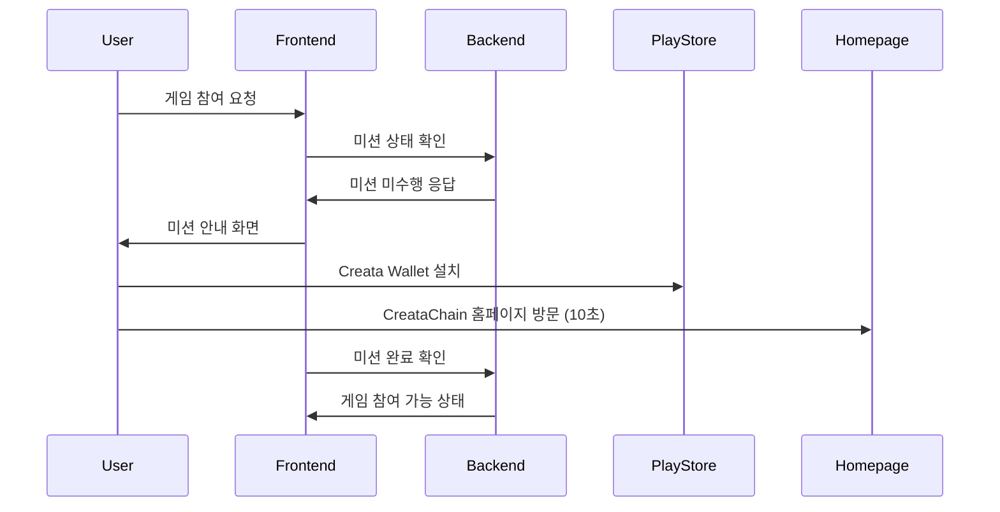
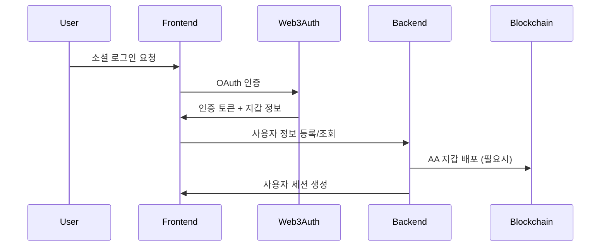
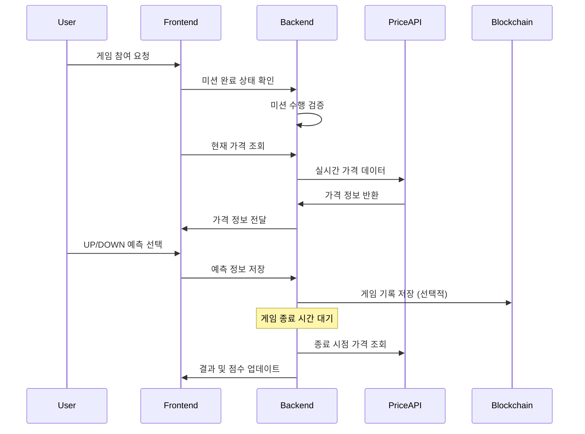
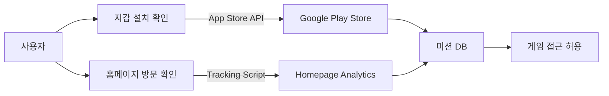
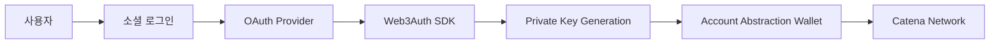

# CTA Mission 시스템 아키텍처

## 📏 전체 시스템 구조

### 시스템 개요
CTA Mission은 Catena 네트워크 기반의 크립토 가격 예측 게임 DApp으로, 마이크로서비스 아키텍처를 기반으로 설계되었습니다.

### 주요 특징
- **사전 미션 시스템**: Creata Wallet 설치 및 홈페이지 방문 확인
- **소셜 로그인 연동**: Web3Auth 기반 Account Abstraction
- **실시간 가격 예측**: 업다운 게임 및 랭킹 시스템
- **자동 에어드롭**: 스마트컨트랙트 기반 보상 지급



### 아키텍처 특징
- **모듈화**: 각 기능별로 독립적인 모듈 구성
- **확장성**: 수평적 확장이 가능한 구조
- **보안성**: Account Abstraction 기반 지갑 시스템
- **실시간성**: WebSocket을 통한 실시간 가격 및 랭킹 업데이트

## 🏢 폴더 구조

### 프로젝트 루트 구조
```
CTA_Mission/
├── frontend/                 # React + Vite 프론트엔드
├── backend/                  # Node.js + Express 백엔드
├── contracts/               # Solidity 스마트컨트랙트
├── docs/                    # 프로젝트 문서
├── infra/                   # 인프라 설정 (Docker 등)
├── .gitignore              # Git 제외 파일
└── README.md               # 프로젝트 설명서
```

### Frontend 구조 (React + Vite) - 실제 구조
```
frontend/
├── public/
│   ├── index.html
│   └── favicon.ico
├── src/
│   ├── components/                 # 재사용 컴포넌트 (평면 구조)
│   │   ├── GameTimer.tsx          # ✅ 게임 타이머 컴포넌트
│   │   ├── Layout.tsx             # ✅ 메인 레이아웃
│   │   ├── MissionCard.tsx        # ✅ 미션 카드 컴포넌트
│   │   ├── MissionList.tsx        # ✅ 미션 목록 컴포넌트
│   │   └── SocialLoginButton.tsx  # ✅ 소셜 로그인 버튼
│   ├── pages/                     # 페이지 컴포넌트
│   │   ├── HomePage.tsx           # ✅ 홈페이지
│   │   ├── LoginPage.tsx          # ✅ 로그인 페이지
│   │   ├── MissionPage.tsx        # ✅ 미션 페이지
│   │   ├── GamePage.tsx           # ✅ 게임 페이지
│   │   └── RankingPage.tsx        # ✅ 랭킹 페이지
│   ├── game/                      # 게임 관련 컴포넌트
│   │   ├── PredictionGame.tsx     # ✅ 예측 게임 컴포넌트
│   │   ├── GameTimer.tsx          # ✅ 게임 타이머 (중복)
│   │   └── ScoreManager.tsx       # ✅ 점수 관리 컴포넌트
│   ├── providers/                 # Context Providers
│   │   └── Web3AuthProvider.tsx   # ✅ Web3Auth 프로바이더
│   ├── hooks/                     # Custom Hooks
│   │   └── useWeb3Auth.ts         # ✅ Web3Auth 훅
│   ├── types/                     # 타입 정의
│   │   ├── index.ts               # ✅ 공통 타입 export
│   │   ├── auth.types.ts          # ✅ 인증 관련 타입
│   │   ├── game.types.ts          # ✅ 게임 관련 타입
│   │   ├── mission.types.ts       # ✅ 미션 관련 타입
│   │   └── web3auth.ts            # ✅ Web3Auth 타입 (기존)
│   ├── services/                  # API 서비스
│   │   └── missionService.ts      # ✅ 미션 서비스
│   ├── config/                    # 설정 파일
│   │   └── web3auth.ts            # ✅ Web3Auth 설정
│   ├── utils/                     # 유틸리티 함수
│   │   ├── cn.ts                  # ✅ 클래스명 유틸리티
│   │   └── web3authInit.ts        # ✅ Web3Auth 초기화
│   ├── App.tsx                    # ✅ 메인 앱 컴포넌트
│   ├── main.tsx                   # ✅ 진입점
│   └── index.css                  # ✅ 전역 스타일
├── package.json                   # ✅ 패키지 의존성
├── vite.config.ts                # ✅ Vite 설정
├── tailwind.config.js            # ✅ Tailwind 설정
├── tsconfig.json                 # ✅ TypeScript 설정
└── .env.example                  # 환경변수 예시
```

### Backend 구조 (Node.js + Express)
```
backend/
├── src/
│   ├── routes/            # API 라우트
│   │   ├── auth.ts       # 인증 관련 라우트
│   │   ├── mission.ts    # 미션 관련 라우트
│   │   ├── game.ts       # 게임 관련 라우트
│   │   ├── ranking.ts    # 랭킹 관련 라우트
│   │   ├── airdrop.ts    # 에어드롭 관련 라우트
│   │   └── price.ts      # 가격 관련 라우트
│   ├── controllers/       # 비즈니스 로직 컨트롤러
│   │   ├── AuthController.ts
│   │   ├── MissionController.ts
│   │   ├── GameController.ts
│   │   ├── RankingController.ts
│   │   └── AirdropController.ts
│   ├── models/           # 데이터 모델
│   │   ├── User.ts         # 사용자 엔티티
│   │   ├── Mission.ts      # 미션 엔티티
│   │   ├── UserMission.ts  # 사용자-미션 관계
│   │   ├── PointHistory.ts # 포인트 이력
│   │   ├── Game.ts         # 게임 엔티티 
│   │   ├── Prediction.ts   # 예측 엔티티 
│   │   └── Ranking.ts      # 랭킹 엔티티 
│   ├── services/         # 서비스 레이어
│   │   ├── AuthService.ts
│   │   ├── MissionService.ts
│   │   ├── GameService.ts
│   │   ├── PriceService.ts
│   │   ├── RankingService.ts
│   │   └── AirdropService.ts
│   ├── middlewares/      # 미들웨어
│   │   ├── auth.ts
│   │   ├── missionCheck.ts
│   │   ├── validation.ts
│   │   ├── rateLimiter.ts
│   │   └── errorHandler.ts
│   ├── config/           # 설정 파일
│   │   ├── database.ts
│   │   ├── blockchain.ts
│   │   ├── oauth.ts
│   │   └── constants.ts
│   ├── utils/            # 유틸리티 함수
│   │   ├── logger.ts
│   │   ├── crypto.ts
│   │   └── helpers.ts
│   ├── types/            # TypeScript 타입 정의
│   │   ├── user.types.ts    # 사용자 타입 정의
│   │   ├── mission.types.ts # 미션 타입 정의
│   │   ├── game.types.ts    # 게임 타입 정의 (예정)
│   │   └── api.types.ts     # API 타입 정의 (예정)
│   └── app.ts            # Express 앱 설정
├── tests/                # 테스트 파일
├── package.json
├── tsconfig.json
└── .env.example
```

## 🔄 현재 개발 상태

### ✅ 완료된 Frontend 컴포넌트
- **Pages**: HomePage, LoginPage, MissionPage, GamePage, RankingPage (5개)
- **Game Components**: PredictionGame, GameTimer, ScoreManager (3개)
- **UI Components**: Layout, MissionCard, MissionList, SocialLoginButton (4개)
- **Providers**: Web3AuthProvider (1개)
- **Types**: 모든 타입 정의 완료 (4개 파일)
- **Services**: missionService.ts (1개)
- **Hooks**: useWeb3Auth.ts (1개)
- **Utils**: cn.ts, web3authInit.ts (2개)

### 📋 주요 특징
1. **평면적 컴포넌트 구조**: components/ 폴더에 모든 컴포넌트가 평면적으로 배치
2. **게임 전용 폴더**: game/ 폴더에 게임 관련 컴포넌트 분리
3. **타입 안전성**: 모든 도메인별 타입 정의 완료
4. **Web3Auth 통합**: 설정, 훅, 프로바이더 모두 구현
5. **Tailwind CSS**: 스타일링 시스템 구축

### 🚧 미완성 항목
- **기본 UI 컴포넌트**: Button, Card, Badge, Modal, ProgressBar 등
- **API 서비스**: gameService, priceService 등 추가 서비스
- **테스트**: 단위 테스트 및 통합 테스트
- **스타일 시스템**: 컴포넌트별 스타일 최적화

## 🔄 데이터 플로우

### 1. 미션 수행 확인 플로우


### 2. 사용자 인증 플로우


### 3. 게임 플레이 플로우


## 📋 데이터베이스 설계

### 주요 테이블/컬렉션 구조

#### Users (사용자)
```typescript
interface User {
  id: string;
  socialId: string;
  socialProvider: 'google' | 'apple' | 'kakao';
  walletAddress: string;
  nickname: string;
  email?: string;
  profileImage?: string;
  totalScore: number;
  gamesPlayed: number;
  missionCompleted: boolean;  // 미션 완료 여부
  walletInstalled: boolean;   // 지갑 설치 여부
  homepageVisited: boolean;   // 홈페이지 방문 여부
  createdAt: Date;
  updatedAt: Date;
}
```

#### Missions (미션)
```typescript
interface Mission {
  id: string;
  userId: string;
  walletInstallCheck: {
    completed: boolean;
    timestamp?: Date;
    appVersion?: string;
  };
  homepageVisitCheck: {
    completed: boolean;
    timestamp?: Date;
    duration: number; // 방문 시간 (초)
    userAgent?: string;
  };
  completedAt?: Date;
  createdAt: Date;
}
```

#### Games (게임 기록)
```typescript
interface Game {
  id: string;
  userId: string;
  tokenSymbol: string;
  startPrice: number;
  endPrice: number;
  prediction: 'UP' | 'DOWN';
  result: 'WIN' | 'LOSE';
  score: number;
  duration: number; // 예측 시간 (분)
  createdAt: Date;
  endedAt: Date;
}
```

#### Rankings (랭킹)
```typescript
interface Ranking {
  id: string;
  userId: string;
  rank: number;
  score: number;
  period: string; // 'weekly', 'monthly'
  airdropAmount: number;
  airdropStatus: 'pending' | 'completed' | 'failed';
  createdAt: Date;
}
```

## 🌐 API 설계

### RESTful API 엔드포인트

#### 인증 관련
```
POST /api/auth/login          # 소셜 로그인
POST /api/auth/logout         # 로그아웃
GET  /api/auth/profile        # 프로필 조회
PUT  /api/auth/profile        # 프로필 업데이트
```

#### 미션 관련
```
GET  /api/mission/status      # 미션 상태 조회
POST /api/mission/wallet      # 지갑 설치 확인
POST /api/mission/homepage    # 홈페이지 방문 확인
GET  /api/mission/progress    # 미션 진행 현황
```

#### 게임 관련
```
POST /api/game/start          # 게임 시작 (미션 완료 필수)
POST /api/game/predict        # 예측 제출
GET  /api/game/history        # 게임 기록
GET  /api/game/leaderboard    # 리더보드
```

#### 가격 관련
```
GET  /api/price/current       # 현재 가격
GET  /api/price/history       # 가격 히스토리
```

#### 랭킹 관련
```
GET  /api/ranking/weekly      # 주간 랭킹
GET  /api/ranking/monthly     # 월간 랭킹
GET  /api/ranking/airdrop     # 에어드롭 내역
```

### WebSocket 이벤트
```
// 클라이언트 → 서버
join_game         # 게임 룸 참여
leave_game        # 게임 룸 나가기
mission_check     # 미션 상태 확인

// 서버 → 클라이언트
price_update      # 가격 업데이트
game_result       # 게임 결과
ranking_update    # 랭킹 업데이트
airdrop_notification # 에어드롭 알림
mission_completed # 미션 완료 알림
```

## 🔐 보안 아키텍처

### 미션 검증 시스템


### Account Abstraction 구조


### API 보안
- **Rate Limiting**: 요청 빈도 제한
- **Mission Check Middleware**: 게임 API 접근 전 미션 완료 확인
- **Input Validation**: 입력 데이터 검증
- **CORS**: 크로스 오리진 요청 제어
- **Helmet.js**: HTTP 헤더 보안
- **JWT**: 토큰 기반 인증

## 📊 개발 진행 상황 요약

### Frontend 모듈 완성도
- ✅ **Pages**: 100% (5/5)
- ✅ **Game Components**: 100% (3/3)  
- ✅ **Core Components**: 100% (4/4)
- ✅ **Types**: 100% (4/4)
- ✅ **Providers**: 100% (1/1)
- 🔄 **Services**: 20% (1/5 예상)
- 🔄 **Utils**: 50% (2/4 예상)

### 다음 개발 우선순위
1. **기본 UI 컴포넌트**: Button, Card, Badge, Modal 등
2. **API 서비스 확장**: gameService, priceService 등
3. **백엔드 연동**: 실제 API 통합
4. **테스트 코드**: 단위 테스트 및 E2E 테스트
5. **성능 최적화**: 코드 스플리팅, 메모이제이션 등

---

*본 문서는 CTA Mission 프로젝트의 실제 구현 상태를 반영한 아키텍처 문서입니다. 향후 개발 진행에 따라 지속적으로 업데이트됩니다.*